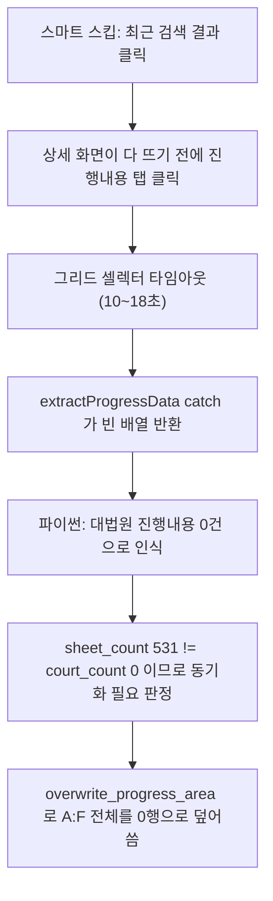

# [치명] 2026-08-12 구글시트 진행내용 대량 삭제 사고

- **발생 일시**: 2026-08-12 08:29 ~ 08:33 (백그라운드 자동 조회)
- **로그 파일**: `logs/app_20260812_083532.log`
- **대상 스프레드시트**: `case-ing-test` / 사건별 워크시트
- **심각도**: 치명 (복구 가능하지만 사용자 데이터 손실)

---

## 1. 증상

백그라운드 자동 조회가 "성공 20건"으로 정상 종료됐다고 보고했는데,
정작 **구글시트의 기존 사건 진행내용이 전부 사라져 있었습니다.**

로그에 반복적으로 찍힌 패턴은 아래와 같습니다.

```
[08:30:46] [Node] ⚠️ 기본 그리드 선택자 실패. 대체 선택자 시도... (interactive)
[08:30:46] [Node] ❌ 진행내용 그리드를 찾을 수 없습니다: Waiting for selector
           `#mf_...ssgoTab2_body_grd_csProgLst_main_div` failed (interactive)
[08:30:47] ✅ 처리 완료: 0건 데이터 추출          ← 실패인데 "완료"라고 찍힘
[08:30:48] 🔄 2024가합45489: 신규 없음, 시트 531행→대법원 0행 맞춤(중복 정리)
[08:30:51] ✅ 진행내용 덮어쓰기 완료: ... (0행 재기록)
[08:30:51] ✅ 검증: 2024가합45489 시트·대법원 진행내용 0행 일치   ← 잘못된 "정상" 판정
```

즉 **조회에 실패했는데 "대법원에 진행내용이 0건이다"라고 해석**했고,
시트를 대법원 결과에 맞추는 로직이 정상 동작하여 기존 531행을 지웠습니다.

## 2. 영향 범위

한 번의 자동 실행에서 아래 사건들의 A:F 진행내용이 0행으로 초기화됐습니다.

| 사건번호 | 삭제된 행 수 |
| --- | --- |
| 2024가합45489 | 531 |
| 2024가합51101 | 401 |
| 2023가합45338 | 387 |
| 2023가합10019 | 210 |
| 2025가합11263 | 205 |
| 2024가합100041 | 138 |
| 2024가합115739 | 106 |
| 2025나210278 | 99 |
| 2025가합13721 | 96 |
| 2025가합15987 | 82 |
| 2026가합5436 | 74 |
| 2025가합11346 | 65 |
| 2024가합103673 | 62 |
| 2026나202481 | 56 |
| 2026가합3688 | 54 |
| 2025가합41096 | 51 |
| 2026가합3554 | 41 |
| 2025나21939 | 29 |
| 2025가단13308 | 28 |
| 2024가단5511076 | 19 |

합계 약 **2,700행 이상**.

**불행 중 다행**: 덮어쓰기 로직은 행 자체를 삭제하지 않고 A:F 범위만 빈 값으로 채웁니다
(`services/google_sheets.py`의 "footer 아래로 남은 옛 A:F 행을 빈 값으로 정리" 단계).
따라서 **G열 이후 사용자 메모는 원래 행 위치에 그대로 남아 있었습니다.**

## 3. 근본 원인

세 개의 문제가 사슬처럼 연결돼 터졌습니다.



### 원인 (1) — 상세 화면 로딩 대기가 너무 느슨했다

`src/PageController.js`의 `clickRecentCase()`에서, 클릭 후 대기 조건이
"진행내용 탭 **엘리먼트가 DOM에 존재하는가**"였습니다.

```js
await this.page.waitForFunction(() => {
  const tab = document.querySelector('#mf_...ssgoCsDetailTab_tab_ssgoTab2');
  const tabBody = document.querySelector('#mf_...ssgoTab2_body');
  return !!tab || !!tabBody;      // 존재만 확인 → 즉시 통과해버림
}, { timeout: 8000 });
```

대법원 사이트는 WebSquare 기반이라 **이전 화면의 탭 DOM이 그대로 남아 있습니다.**
그래서 이 조건은 화면이 아직 안 바뀌었는데도 수십 ms 만에 통과했습니다.

로그가 이를 증명합니다. 실패한 사건은 예외 없이 일반내용이 전부 0이었습니다.

```
[Node] 📊 [일반내용] basic=20키, 기일=0, 서류=0, 당사자=0, 대리인=0   ← 화면 미로딩
```

반대로 성공한 사건은 `기일=4, 서류=4, 당사자=7` 처럼 값이 채워져 있었습니다.

### 원인 (2) — 실패를 "빈 결과"로 위장했다 (핵심)

`src/PageController.js`의 `extractProgressData()` 마지막 `catch`:

```js
} catch (error) {
  console.error(`❌ 진행내용 데이터 추출 실패 (${this.browserId}):`, error.message);
  return [];        // ← 실패인데 "0건"이라는 정상 결과로 둔갑
}
```

호출하는 쪽은 `[]`를 받고 **"조회는 성공했고 진행내용이 없는 사건"** 으로 판단합니다.
"실패"와 "진짜 0건"을 구분할 방법이 아예 없었습니다.

### 원인 (3) — 시트를 지우기 전 안전장치가 없었다

`services/process_controller.py`의 `_process_result_list`:

```python
court_count = len(result_data) if isinstance(result_data, list) else 0
...
needs_sync = bool(new_data) or sheet_count != court_count
```

`sheet_count=531`, `court_count=0` 이면 "행 수가 다르니 맞춰야 한다"고 판단하여
`overwrite_progress_area(case, [])`를 호출합니다.
**"기존 데이터가 잔뜩 있는데 결과가 0건"이라는 명백히 의심스러운 상황을 걸러내지 않았습니다.**

게다가 검증 함수 `_validate_sheet_sync`는 "시트 0행 == 대법원 0행"이니
`✅ 검증 ... 0행 일치`라며 **사고를 성공으로 보고**했습니다.

## 4. 왜 막지 못했나

- 방어 코드가 **한 겹도** 없었습니다. Node → 파이썬 → 시트 저장까지 3단계를 거치는데,
  어느 단계도 "0건인데 기존 데이터가 있다"를 이상 상황으로 보지 않았습니다.
- 로그 메시지가 오히려 안심을 시켰습니다. `✅ 처리 완료: 0건 데이터 추출`,
  `✅ 검증 ... 0행 일치`, `조회 완료: 성공 20건` — 전부 초록색 성공 메시지였습니다.
- 사고 직전 커밋에서 스마트 스킵 대기 로직을 "고정 2초 대기 → 조건부 대기"로 바꿨는데,
  **바꾼 조건이 실질적으로 아무것도 기다리지 않는 조건**이었음을 검증하지 않았습니다.

## 5. 복구 방법

구글시트 **버전 기록**으로 되돌렸습니다.

1. 스프레드시트에서 `파일 > 버전 기록 > 버전 기록 보기`
2. 2026-08-12 08:29 **이전** 버전 선택
3. `이 버전 복원` 클릭
4. 복구 확인: `2024가합45489`가 531행, `2023가합45338`가 387행으로 되살아났는지 확인

> 참고: 대법원에서 재조회해 A:F를 다시 채우는 방법도 가능하지만,
> E·F열(업데이트 표기·발송 이력)과 셀 색상 일부가 원본과 달라질 수 있어
> **버전 기록 복원이 더 안전합니다.**

## 6. 재발 방지 코드 — 지우지 말 것

아래 가드는 이 사고 때문에 존재합니다. 제거 전 반드시 이 문서를 읽으십시오.

| 위치 | 가드 내용 |
| --- | --- |
| `src/PageController.js` `extractProgressData()` | `catch`에서 `return []` 금지. 에러를 다시 던져 실패를 실패로 전달. 단 화면에 "조회된 내용이 없습니다"가 있을 때만 진짜 0건으로 `return []`. |
| `src/PageController.js` `clickRecentCase()` | 탭 엘리먼트 존재가 아니라 **상세 화면에 해당 사건번호가 실제로 렌더됐는지** 확인 후 진행. |
| `services/puppeteer.py` | Node의 추출 실패를 `0건 성공`이 아니라 실패로 상위에 전달. |
| `services/process_controller.py` `_process_result_list` | `court_count == 0 and sheet_count > 0` 이면 덮어쓰기를 중단하고 실패 처리(`🛑 보호` 로그). |
| `services/google_sheets.py` `overwrite_progress_area` | `allow_empty=False` 기본값. 기존 진행내용이 있는데 빈 데이터로 덮어쓰려 하면 거부. |

## 7. 교훈 (앞으로 지킬 체크리스트)

1. **`catch`에서 빈 값을 반환하지 말 것.** 실패는 실패로 던지거나, 최소한 실패임을 나타내는
   별도의 값(sentinel)을 반환해야 합니다. `[]`, `0`, `""`는 "정상적인 빈 결과"와 구분이 안 됩니다.
2. **파괴적 작업(삭제·덮어쓰기) 전에는 반드시 정상성 검사를 넣을 것.**
   "기존 데이터가 N행 있는데 새 데이터가 0행"은 거의 항상 버그입니다.
3. **"기다리기" 조건은 실제로 기다려지는지 확인할 것.**
   엘리먼트 존재 여부는 SPA/WebSquare에서 신뢰할 수 없습니다. 내용(텍스트·행 수)으로 판단하세요.
4. **성공 로그를 함부로 찍지 말 것.** `✅ 처리 완료: 0건`처럼 실패를 성공처럼 보이게 하는
   메시지는 사고를 늦게 발견하게 만듭니다.
5. **자동화 로직을 수정했으면, 첫 자동 실행 결과를 반드시 눈으로 확인할 것.**
   특히 시트 행 수 변화(`N행→0행` 같은 로그)는 즉시 경보로 취급합니다.
