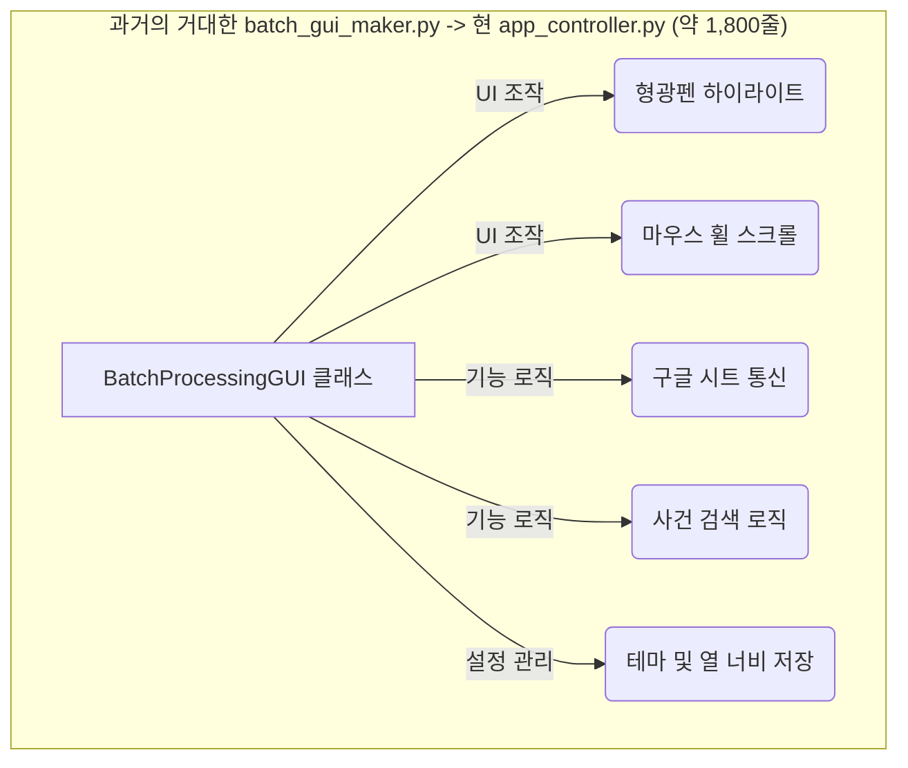
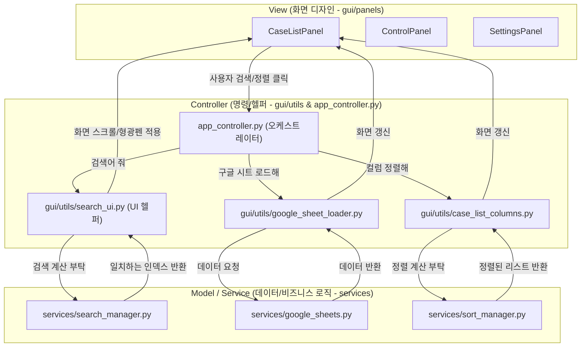

# 프로그램 아키텍처 리팩토링 다이어그램 (MVC 패턴 적용)

`app_controller.py`의 번잡함을 해소하기 위해 진행한 "화면(View)과 기능(Model/Service)의 분리" 과정을 시각화한 다이어그램입니다.

## 1. 과거의 구조 (Tight Coupling)

모든 기능과 UI 디자인이 `batch_gui_maker.py`(현 `app_controller.py`)라는 하나의 거대한 파일 안에 뒤엉켜 있었습니다.
이로 인해 디자인을 수정하면 기능이 고장나고, 기능을 수정하면 화면 스크롤이 고장나는 문제가 발생했습니다.

## 2. 현재 / 목표 구조 (MVC 분업화)

현재 우리는 코드를 3가지 계층으로 명확히 분리하는 리팩토링을 진행 중입니다.
- **Model/Service (두뇌)**: 화면 위젯(Tkinter)을 전혀 모르는 순수 데이터 처리 로직.
- **View (손발)**: 데이터를 보여주고 버튼을 그리기만 하는 디자인 전용 모듈.
- **Controller (사령탑)**: 사용자의 클릭을 받아 Service에 계산을 시키고, 결과를 View에 넘겨주는 역할.

### 왜 이렇게 나누나요?
- **유지보수성 향상**: 검색 알고리즘을 고치고 싶다면 `search_manager.py`만 보면 됩니다. 형광펜 색깔을 바꾸고 싶다면 `search_ui.py`만 보면 됩니다.
- **코드 경량화**: `app_controller.py`는 이제 직접 일하지 않고 "각 부서에 지시만 내리는 역할"을 하므로 코드가 수백 줄 이상 줄어들어 읽기 쉬워집니다.
